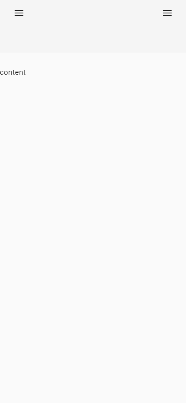

# Sidenav Template Angular

Plantilla HTML con menu lateral derecho, y 2 divisiones para el contenido, primera division mas pequeña que la segunda. Cuando la pantalla es muy pequeña el contenido de la primera division pasa a estar en un sidenav izquierdo.

## Vista previa

### Pantalla grande (sidenav derecho cerrado)


### Pantalla grande (sidenav derecho abierto)


### Pantalla pequeña (sidenav izquierdo cerrado)



### Pantalla grande (sidenav izquierdo abierto)


## Recursos necesarios

### Angular material 

Para instalar Angular Material para angular cli en su proyecto ejecute el siguiente comando: 

```bash
ng add @angular/material
```

Si necesita más información puede ver la [documentación oficial.](https://material.angular.io/)

# Implementacion de la plantilla en un proyecto

## Immmportación componentes de angular material

Para usar la plantilla son necesarios varuios componentes de angular material. Estos deben configurarse de manera global por lo que se deben hacer las siguientes importaciones en el archivo **app.module.ts**

```typescript
import {MatSidenavModule} from '@angular/material/sidenav';
import {MatToolbarModule} from '@angular/material/toolbar';
import {MatIconModule} from '@angular/material/icon';
import {MatButtonModule} from '@angular/material/button';
```

El Modulo de importaciones deberá verse de la siguiente manera 

```typescript
@NgModule({
  declarations: [
    AppComponent,
    HomeComponent
  ],
  imports: [
    BrowserModule,
    NgbModule,
    BrowserAnimationsModule,
    //Angular material
    MatSidenavModule,
    MatIconModule,
    MatButtonModule,
    MatToolbarModule
    //fin angular material
  ],
  providers: [],
  bootstrap: [AppComponent]
})
```

## Creacion de componentes

Los nombres de los componentes que se vayan a utilizar pueden varias, para esta plantilla se utilizaron ciertos nombre que puede cambiar segun lo requiera su proyecto.

### HomeComponent 

Este componente contiene todo lo necesario para mostrar la plantilla inicial.

Para crear el componente en angular cli use el siguiente comando:
```bash
ng g c components/home
```

### Archivo HTML

```html
<mat-sidenav-container class="sidenav_container" (backdropClick)="close('backdrop')">
    <mat-sidenav #sidenav (keydown.escape)="close('escape')" disableClose>
        <mat-toolbar class="head__sidenav ">
            <span class="spacer"></span>
            <h6>Encabezado</h6>
            <span class="spacer"></span>
            <button mat-icon-button (click)="close('toggle button')">
                <mat-icon>close</mat-icon>
            </button>
        </mat-toolbar>
        <div class="container-fluid">
            <p>content start vivsible here</p>
        </div>
    </mat-sidenav>
    <mat-sidenav position="end" #sidenavend (keydown.escape)="close('escape')" disableClose>

        <mat-toolbar class="head__sidenav ">
            <button mat-icon-button (click)="close('toggle button')">
                <mat-icon>close</mat-icon>
            </button>
            <span class="spacer"></span>
            <h6>Encabezado</h6>
            <span class="spacer"></span>
        </mat-toolbar>

    </mat-sidenav>
    <mat-sidenav-content>
        <mat-toolbar class="toolbarPhone">
            <mat-toolbar-row>
                <button mat-icon-button (click)="sidenav.open()">
                    <mat-icon>menu</mat-icon>
                </button>
                <span class="spacer"></span>
                <button mat-icon-button (click)="sidenavend.open()">
                    <mat-icon>menu</mat-icon>
                </button>
            </mat-toolbar-row>
            <mat-toolbar-row>

                <span class="spacer"></span>

            </mat-toolbar-row>
        </mat-toolbar>
        <mat-toolbar class="toolbarlarge">
            <!-- <button mat-icon-button (click)="sidenav.open()">
                <mat-icon>menu</mat-icon>
            </button> -->
            <span class="spacer"></span>
            <button mat-icon-button (click)="sidenavend.open()">
                <mat-icon>menu</mat-icon>
            </button> 
        </mat-toolbar>
        <!--Container-->
        <div class="container_page">
            <div class="container_start">
                <p>start</p>

            </div>
            <div class="container_main">

                <p>content</p>
            </div>
        </div>
    </mat-sidenav-content>
</mat-sidenav-container>
```

### Archivo CSS

```css
  /*SideNav*/

  .icon_close_head {
    cursor: pointer;
}

.head_carr_end {
    color: #000;
    font-weight: 300;
}

.spacer {
    flex: 1 1 auto;
}

mat-sidenav {
    width: 365px;
}

@media screen and (max-width: 365px) {
    mat-sidenav {
        width: 100%;
    }
}

.sidenav_container {
    display: flex;
    flex-direction: column;
    position: absolute;
    top: 0;
    bottom: 0;
    left: 0;
    right: 0;
}

/*Fin SideNav*/

/*Toolbar*/

.icon_toolbar {
    font-size: 22px;
}

.toolbarPhone {
    display: none;
}

.toolbarPhone, .toolbarlarge {
    position: fixed !important;
}

@media screen and (max-width: 767px) {
    .toolbarlarge {
        display: none !important;
    }
    .toolbarPhone {
        display: block !important;
    }
}

/*Fin Toolbar*/

/*Contendo derecho*/

.container_main::-webkit-scrollbar {
    width: 7px;
}

.container_main::-webkit-scrollbar-track {
    background: #f3c5d3;
}

.container_main::-webkit-scrollbar-thumb {
    background-color: #FD306E;
    border-radius: 20px;
    border: 3px #f3c5d3;
}

.container_page {
    height: 100vh;
    width: 100vw;
    margin-top: 65px;
    position: fixed;
}

.container_start {
    width: 190px;
    height: 100%;
    float: left;
    overflow: auto;
}

.container_main {
    width: calc(100% - 190px);
    height: 100%;
    float: left;
    overflow: auto;
}


@media screen and (max-width: 767px) {
    .container_start {
        display: none;
    }
    .container_page {
        margin-top: 128px;
    }
    .container_main {
        width: 100%;
    }
}

.head__sidenav {
    height: 44px !important;
}

/*Fin Contendo derecho*/
```

### Archivo .ts

```typescript
import { Component, ViewChild } from '@angular/core';
import { MatSidenav } from '@angular/material/sidenav';

@Component({
  selector: 'app-home',
  templateUrl: './home.component.html',
  styleUrls: ['./home.component.css']
})
export class HomeComponent {
 //Abrir/Cerrar SideNav
 @ViewChild('sidenav')
 sidenav!: MatSidenav;
 @ViewChild('sidenavend')
 sidenavend!: MatSidenav;

 //Abrir cerrar Sidenav
 close(reason: string) {
   this.sidenav.close();
   this.sidenavend.close();
 }
}
```